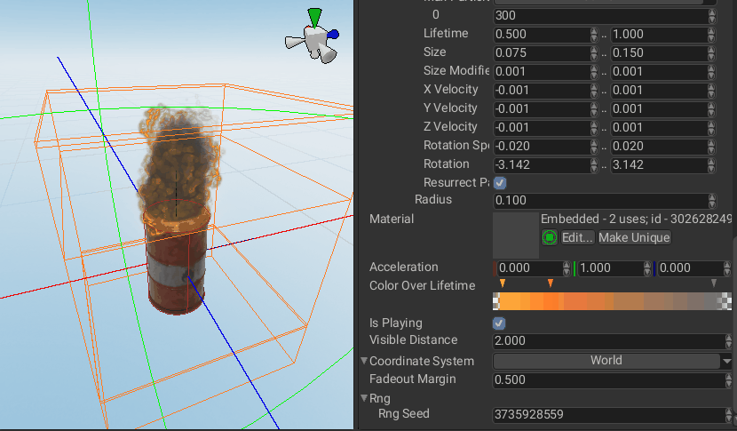
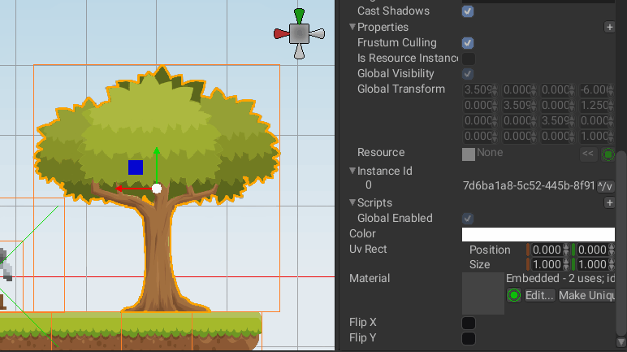
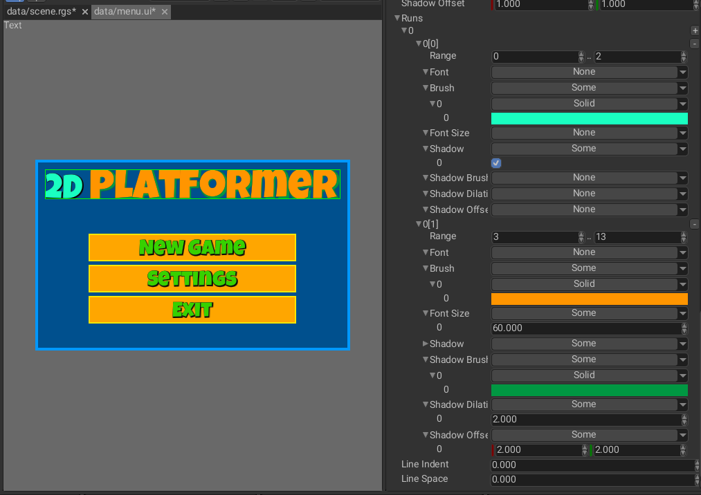
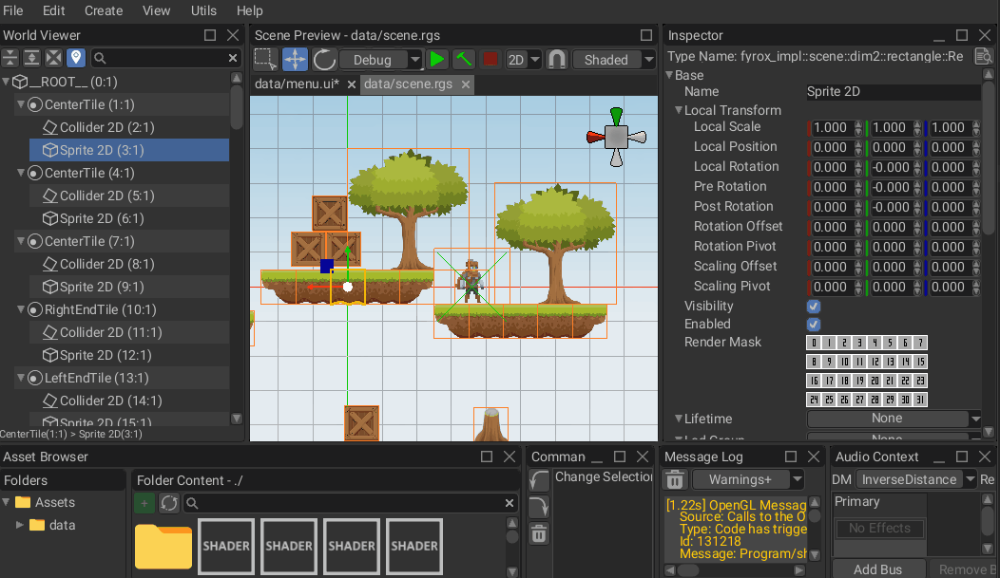
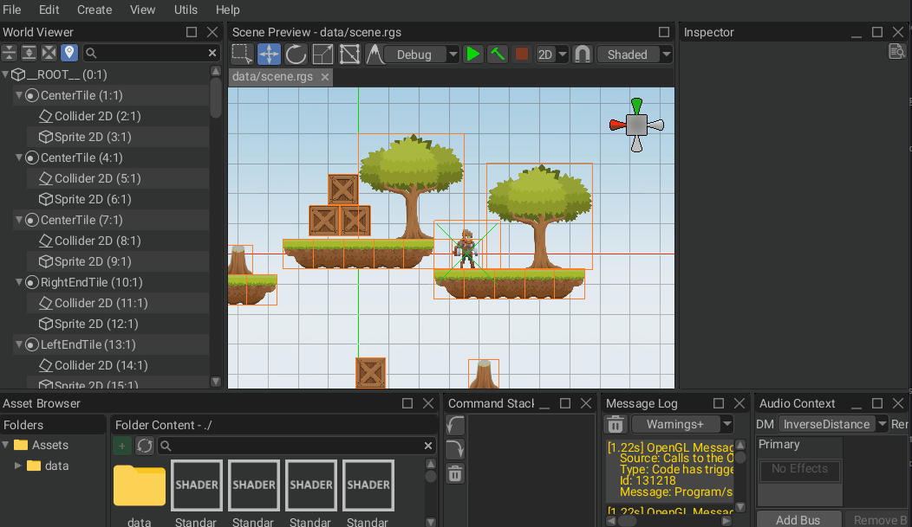
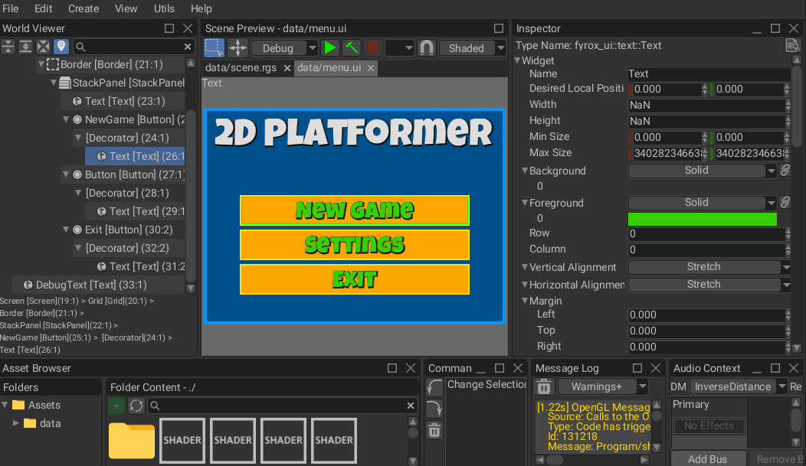
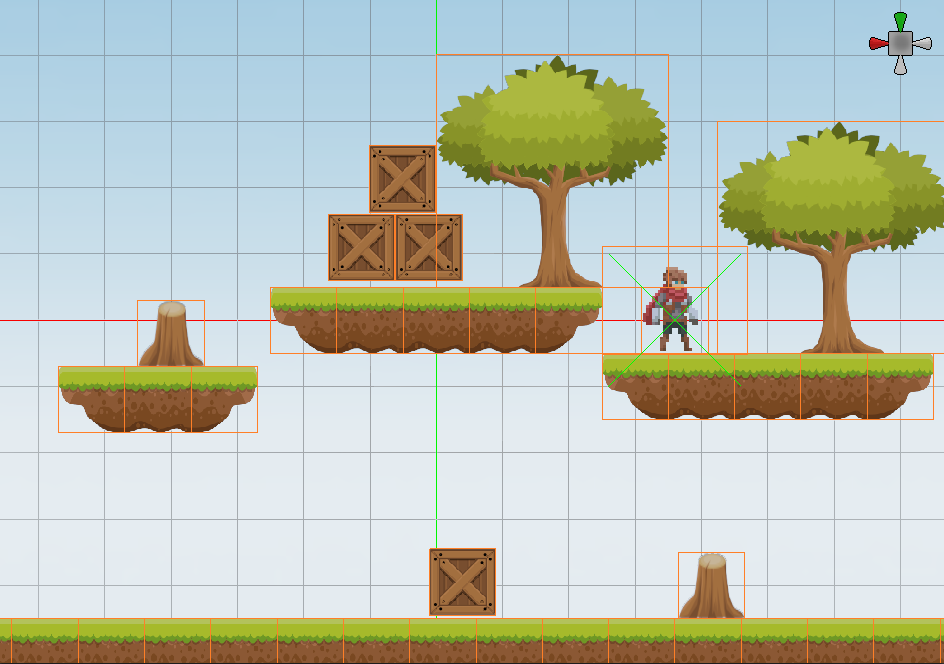

I'm happy to announce that Fyrox 1.0.0-rc.1 was released! Fyrox is a modern game engine written in Rust, it
helps you to create 2D and 3D games with low effort using native editor; it is like Unity, but in Rust. 

This is an intermediate release intended for beta testing before releasing the stable 1.0. The testing includes 
the engine, the editor, the docs and the book. If you find a bug, confusing or incomplete documentation, please 
file an issue or propose a solution by creating a pull request.

The list of changes in this release is huge, it is mostly focused on bugfixes and quality-of-life improvements, 
but there's a new functionality as well.

# Type Safety

For a long time Fyrox supported only "untyped" handles (such as `Handle<Node>` or `Handle<UiNode>`), this 
approach was bug-prone because it effectively erased all the useful type information. This release adds
strongly typed handles for all the scene and UI entities. It is now possible to store `camera: Handle<Camera>`
in a script and access the camera by it using a simple `graph[camera].projection_matrix()`. There's no need 
to do a manual type casting. Typed handle improved the editor side as well - the handle selector will show 
only the objects of the right type.

# Resource Management

Resource system is now UUID-based and resource references are now stored as a simple UUID instead of paths
as it was before. This allows renaming the source files of resources without a need to scan the entire project
for path-based links and fix them. 

Such transition comes with a price - every resource now must have a `.metadata` file beside it that stores 
its UUID. This file must not be deleted, it also must be moved together with the source file of a resource.
This fact complicates the implementation of the resource manager quite significantly.

This refactoring also added a concept of a resource registry. In short - it is a map `UUID -> Path` that
holds information about all the resources in the project. Resource registry tracks the file system changes
and automatically updates itself (on PC only). It can be considered as a custom file system. It is very
useful for platforms where no file system is available (WebAssembly).

The resource manager was improved significantly as well, it now offers more consistent API with some new 
features. One of the most significant features is an ability to move a folder with resources.  

# Asset Format

Fyrox now uses text-based format for its native assets. This adds an ability to merge changes from collaborative
work. Text format is then converted to binary form for production builds (can be disabled), which improves 
loading times. The syntax is very simple:

```text
Item32[Generation<u32:1>]
{
	Payload[IsSome<u8:1>]
	{
		Data[TypeUuid<uuid:caaf9d7b-bd74-48ce-b7cc-57e9dc65c2e6>]
		{
			NodeData[BlendShapesPropertyName<str:"blendShapesStorage">]
			{
				Common[Name<str:"Cube">IsResourceInstance<bool:false>InstanceId<uuid:e11239e5-5243-40bd-a66e-5f79fd6f88b5>]
				{
					Transform[]
					{
						LocalScale[Value<vec3f32:2.2868934; 1.699784; 0.1647437>Flags<u8:1>]{}
						LocalPosition[Value<vec3f32:0; 0; 0>Flags<u8:1>]{}
						LocalRotation[Value<quat:0; 0; 0; 1>Flags<u8:1>]{}
					}
					Visibility[Value<bool:true>Flags<u8:1>]{}
					Parent[Index<u32:30>Generation<u32:1>]{}
					Children[Length<u32:0>]{}
					Resource[IsSome<u8:0>]{}
					FrustumCulling[Value<bool:true>Flags<u8:1>]{}
					CastShadows[Value<bool:true>Flags<u8:1>]{}
					Enabled[Value<bool:true>Flags<u8:1>]{}
					RenderMask[Value<u32:4294967295>Flags<u8:1>]{}
					Scripts[Length<u32:0>]{}
				}
			}
		}
	}
}
```

This is a custom format that was designed for better mergeability and type safety. An object starts with a name that
followed by `[attributes]` which is then followed by `{children objects}`. Each attribute starts from a name and followed
by a body `<type:value>`.

# Rendering

Physically-based rendering pipeline is now fully complete and supports image-based lighting (IBL), environment
mapping, and reflection probes. 

Ability to select environment light source for scenes
Use ambient occlusion from material info in ambient lighting shader

By default, every scene uses skybox as a source of lighting (if there's no reflection probe). This may be undesirable in
some cases (for example - in stylized graphics) and a flat color can be used instead. It could be specified either in 
scene settings in the editor, or in scene rendering settings from code.

## Render target for cameras 

It is now possible to specify render targets for cameras. It could be useful to create virtual in-game cameras that 
show some other areas are in the game. 

## Particle System  (TODO)



Particle systems now have a built-in ability to fadeout when far away from the camera. It is a very useful optimization
that allows disabling distant particle system and free GPU resources.

## Skybox (TODO)

Skybox was moved from camera to scene

## Improved Debugging

Fyrox now tries to assign meaningful names for GPU objects to simplify debugging via various graphics
debuggers. This option is off by default, but it can be enabled pretty easily:

```rust
fn main() {
    let executor = Executor::from_params(
        EventLoop::new().ok(),
        GraphicsContextParams {
            // This option forces the engine to use meaningful names for
            // GPU objects (textures, buffers, shaders, etc.)
            named_objects: true,
            window_attributes: WindowAttributes::default(),
            vsync: true,
            msaa_sample_count: None,
            graphics_server_constructor: Default::default(),
        },
    );
    // ...
}
```

Accurate GPU profiling is a hard task, because GPUs work independently of CPUs and any attempt to measure how 
much time is spent on GPU from the CPU side will only measure how much time was spent to prepare and issue
commands for a GPU. That being said, profiling requires specialized tools for target GPUs. Use  
[NVIDIA Nsight](https://developer.nvidia.com/nsight-systems) or 
[AMD Radeon GPU Profiler](https://gpuopen.com/rgp/), depending on the GPU you're using.
[RenderDoc](https://renderdoc.org/) also has _some_ ability to measure GPU times, but its precision is not 
very high.

Ability to fetch memory usage by the graphics server
 Track vertex/fragment shader line location

## OpenGL Isolation

Fyrox used OpenGL from the very beginning (2019), because it was the easiest way to get crossplatform
graphics on a wide variety of platforms (remember, wgpu didn't even exist at that time). While it still
works ok, it is quite messy and has lots of bugs. This release isolated OpenGL in a separate crate and 
exposed public API for a graphics server that will be used in the future releases to transition to 
modern GAPIs.

# Scene  (TODO)


## Flipping for Sprite/Rectangle Nodes



Sprite (3D) and Rectangle (2D) scene nodes now have an ability to flip in both vertical and horizontal directions.
It was possible to flip these nodes before by setting its scale to negative values for desired axes, but this approach
has undesired effects. When a node is flipped by its scaling, all its children nodes will be flipped as well. This may
ruin some hierarchies where flipping shouldn't affect descendant nodes. For example if there's an NPC with a name strip
above it, flipping it by negative scaling will result in flipped text, while `Flip X/Y` options will flip only the 
sprite/rectangle.

# Input  (TODO)

Simplified interaction with keyboard and mouse.
Simplified way of getting input state

# Physics  (TODO)

- Joint motors

# User Interface  (TODO)

The user interface system has gotten tons of useful improvements and fixes in this release.

## Performance

This release contains a lot of performance improvements for the user interface system. The overall performance increase 
is about 50%. The main source of performance increase is layout system improvements. Previously, the UI updated screen
space information on every frame for every widget. Now it does this only for the widgets that actually changed. This
includes screen position calculation, clipping bounds calculation, visibility flags calculation, etc. 

This optimization increased overall editor performance by 50% as well. The editor has a huge number of widgets alive
at the same time (15k+) and updating this huge pile of data was redundant, because 99.99% of widgets in the editor are
static and moved only if a user decides to move them. 

This change didn't affect the public API, and didn't break backward compatibility.

## Text Runs



Text now supports so-called runs which allows you to change the appearance of individual portions of the text. Each run
can modify font, its size, brush, and shadow properties. It can be used to stylize the text, for example, in some games, 
the description of items may use runs to highlight damage, armor, level, etc.

Each run is defined by a pair of indices of letters in the text and a bunch of properties. The ranges can overlap, the
last one on the overlapping set has the top priority.

## Widget Materials  (TODO)

- Ability to specify custom shaders for widgets

## Improved Docking



Docking manager now supports any number of windows in a tile, this means that you can now put multiple windows in a
tile and switch between them. It is also possible to rearrange them by dragging.

# Editor  (TODO)

## Async scene loading

The editor now loads the scenes (both game and UI) asynchronously, not just blocks like it was before. This is much
better in terms of user experience, because it leaves the editor responsive.

## Ability to reset editor layout



It is now possible to reset the editor layout to its defaults. It wasn't possible before, and in some situations it
leads to corrupted layout that isn't usable at all. The only way to reset the editor's layout before was to delete 
the editor settings file. Now all you need is to press `View -> Reset Layout`.

## Copy/Paste for Inspector



It is now possible to copy and paste the values of object properties in the inspector. This feature was missing for a
long time and added a lot of headache when there was a need to copy complex values from one object to another. In this
release, it is finally added. This functionality works on multiple selected objects as well, thus allowing bulk pasting
of properties.

## Asset browser  (TODO)

Asset browser got lots of improvements in this release.

Show selected path in the main window of the asset browser
 Placeholder icon for resources without preview generator
  Added placeholder icon for asset items whose preview is being generated
Ability to inspect and edit supported assets in inspector
Ability to move a folder with resource in the resource manager
Highlight asset item when it accepts drop

Asset preview tooltips
Added confirmation dialog for asset deletion
Ability to rename assets in the asset browser 
 Asset rename dialog improvements

 Asset selector

## Settings  (TODO)

- Added a setting to modify editor camera's mouse sensitivity

## 2D Grid



The editor now shows grid in 2D mode. The grid's cell size can be configured in the editor settings.

# Reflection

Reflection system was improved as well. The most significant feature is an ability to clone an object through 
`&dyn Reflect`. This ability is used in the editor to copy/paste values in the inspector. Since not all objects
that implement `Reflect` trait are cloneable, it is possible to mark such a type via `#[reflect(non_cloneable)]`
attribute.

Field metadata fetching was also changed, instead of six separate methods there are only two now: `Reflect::fields_ref` 
+ `Reflect::fields_mut`. These methods return an array of references to fields and their metadata.

# Documentation

This release contains significant improvements in the API documentation and the book. The book
now covers around 80% of the engine. This number will be 100% with the stable release.

# What's Next?

The next major goal for the project is to release Fyrox 1.0, which is planned for December 2025. 

# Support

If you want to support the development of the project, click [this link](https://fyrox.rs/sponsor.html). Also, you can help by 
fixing one of the ["good first issues" ](https://github.com/FyroxEngine/Fyrox/issues?q=is%3Aopen+is%3Aissue+label%3A%22good+first+issue%22),
adding a desired feature to the engine, or making a contribution to the [book](https://github.com/fyrox-book)

# Full List of Changes

The list is split into four sections for ease of reading and finding particular information.

## Fixed

- Fixed performance issues when deleting an object in the editor
- Use ambient occlusion from material info in ambient lighting shader
- Fixed skybox editing in scene settings
- Fix build window (handle stderr and stdout in different threads)
- Fixed ssao rendering
- Exit build mode after successful build
- Prevent loss of piped data due to BufReader dropping
- Fixed cube texture to use only one size parameter instead of width+height
- Fixed layout of resource property editor
- Fixed reflection probe rendering with fxaa enabled
- Add details to FieldTypeDoesNotMatch error to improve warnings
- Check if a property can be cloned/pasted in the inspector
- Fixed box selection in the editor
- Improved selection order in the editor
- Context menu handling for various inspectors
- Fixed smart placement for move interaction mode
- Fixed grid blending issues
- Fail-safe shader/material handling when rendering
- Fixed incorrect sampler params
- Prevent clamping for infinite available size in the UI
- Fixed axes colors for grid shader
- Adjust grid cell size to match grid snapping options
- Support all three major plane orientations (oXZ,oXY,oYZ) in grid shader
- Improved selection in the editor
- Fixed incorrect viewport handling for camera render targets
- Do not crash if render data couldn't be created, return an error instead
- Filter out editor-specific scene nodes when using camera preview
- Remove render data for destroyed cameras
- Use separate render target for camera preview in the editor
- Added missing tab labels for 'Settings' and 'Navmesh' panels
- Added missing interaction modes shortcuts for terrain and navmesh
- Fixed terrain holes incorrect command name
- Making relative paths for loading and saving scenes
- Remove redundant BrushMacro method remove_cell
- Highlight allowed types better in the node selector
- Use typed_ref/mut methods in graph indexing impl
- Show/hide camera preview image
- Fixed interaction mode order in the toolbar to follow indices: 1..6
- Fixed distance sorting for meshes
- Collect only supported resources + ignore resources from excluded dirs
- Fixed render order to be back-to-front for correct blending
- Improved gizmo and exposed scale in editor settings
- Prevented the camera frustum in debug draw from being scaled
- Improved camera focus distance to be less close to the object
- Correcting make_relative_path and scene saving logic.
- Allowing make_relative_path to accept non-existing files
- Improving error reporting for missing InspectorEnvironment
- Fixed scene gizmo lighting
- Fixed crash when an invalid asset is drag-dropped onto a surface field
- Fixed crash when an empty string is used in the asset browser search
- Fixed crash when CSM near and far values are superimposed
- Fixed documentation for VisitError::NotSupportedFormat
- Made "Show in explorer" work on other OS's
- More concise naming for Reflect methods
- Handle UI scaling in Screen Widget
- Fixed potential crash in the editor
- Improved performance of dynamic drawing methods
- Fixed resource registration
- Fixed deadlock when loading a resource
- Preserve global transform when reparenting scene nodes
- Fixed misleading docs
- Fixing minimization for windows.
- Fixed distance sorting
- Reset editor camera rotation when in 2d mode
- Fixed matrix2 deserialization
- Fixing cut-off text in tooltips
- Protecting against resource deadlock
- Hold mutex locks as short as possible to prevent deadlocks
- Use blocking resource registry updating where possible
- Correcting terrain hole mask bug
- Fixed asset item context menu not showing on rmb click
- Do not try to reload unsupported resources.
- Moving plugin and script handling to before node handling to fix teleportation glitch
- Print error message instead of silently writing an error to the resource
- Use trait upcasting and remove `as_any` for `ResourceData`
- Fixed usages of ResourceKind
- Fixed asset preview generation
- Fixed built-in resource handles deserialization
- Ability to create metadata files
- Proper headless mode
- Hide asset preview if there's no actual preview data for it
- Fixed gltf shader
- Fixed incorrect syncing of modified flag in the property editor
- Prevent annoying message spam when import options are missing for asset
- Fixed ambient lighting in case of non-skybox lighting
- Render overlay icons only in the scene preview
- Hide "revert" button for inheritable properties when no parent object
- Improved performance of visual transform calculation in ui
- Improved ui performance
- Fixed blending issues when batching multiple rectangles
- Fixed fitting for asset preview
- Fixed visual glitch for scaling, rotation, and movement gizmos
- Fixed update loop state in the editor
- Fixed deletion of gl vao/gpu programs/textures
- Fixed incorrect caching/binding of gl framebuffer
- Handle invalid aabb/division by zero when doing camera fitting
- Fixed menu item content alignment + `make_menu_splitter` helper
- Reset visual state of a selected option in the dropdown list on select
- Fixed asset preview update when a resource changes
- Significantly reduced annoying visual lag when generating asset previews
- Correctly detach the content of control panels of various entities
- Fixed text alignment in various places in the editor
- Fixed asset preview
- Do not stop deserialization on invalid resource refs
- Fixed inability to add animation track for a node
- Better lighting for asset preview
- Fixed torus faces orientation
- Fixed deferred preview generation for assets in asset selector
- Fixed `Option::None` serialization
- Fixed camera picking issues
- Do not change resource uuid when moving it in the editor
- Log window improvements + fixes
- Fixed crash when trying to select text in the text box via double click
- Fixed resource movement in the asset browser
- Fixed incorrect position of dragndrop preview when dpi scaling is used
- Update asset preview if the asset changes
- Properly handle added/removed resources to/from the resource registry
- Use correct material in `MaterialFieldEditor`
- Fixed crash in case of invalid material resource used in ui renderer
- Fixed request of built-in resources in the resource manager
- Fixed incorrect color space in standard forward pass of standard shaders
- Fixed black screen bug when saving a scene with active camera preview
- Prevent deadlock when trying to get a debug name for gpu texture
- Fixed incorrect ambient lighting calculation
- Reduced memory usage when generating asset previews
- Clamp anisotropy in `[1.0; 16.0]` range to prevent video driver errors
- Fixed `uuid_provider` macro
- Correcting InheritableVariable::visit and physics integration parameters dt
- Fixed selection button being clipped on material property editor
- Fixed gimbal lock in GLTF animations
- Prevent crash on empty uniform blocks
- Update the material editor when hot-reloading a shader
- Fixed crash on material hot-reloading when a property was removed

## Added

- Added image-based lighting (IBL)
- Name for gpu buffers
- Named gpu textures
- Ability to specify mip level for frame buffer attachments
- `GraphicsServer::create_cube_render_target`
- Added runs to FormattedText
- `Texture::new_cube_render_target`
- Environment mapping
- Reflection probe node
- `fyrox_widgetData` built-in property group
- Ability to specify custom shaders for widgets
- Documentation and helper methods for colliders
- Implementing Debug and Display for BitMask.
- Brdf lut generator
- Ability to copy/paste values in the editor setting's inspector
- `UserInterface::has_descendant_or_equal`
- `Inspector::handle_context_menu_simple`
- `GpuShader` entity
- `Reflect::try_clone_box`
- Ability to copy/paste values in inspector
- Added `is_significant` method for editor commands
- Show grid in 2d mode in the editor
- Docking manager for asset browser
- Echo popup messages
- `Copy Value` + `Paste Value` options in context menu of `Inspector`
- Collect property paths in the inspector widget
- `UserInterface::send_messages` to send multiple messages at once
- Implemented `BorrowAs` trait for widget handles
- Enhanced tile set editing, copying pages
- Debug impl for NodeHandleMap
- Movable scene tabs
- `GraphicsServer::generate_mipmap`
- `RendererResources` with preloaded resources
- Ability to specify the face of the cube map in frame buffer attachment
- Environment cube map prefilter shader
- Blanket impl for ScriptMessagePayload replaced with derive macro
- Print allowed type name in the node selector + do type checking
- Ability to set derived handle types in the handle editor
- Dynamically typed script messages
- Added a setting to modify editor camera's mouse sensitivity
- `Reflect::fields_info_mut` + optimizations
- More methods for handles accessed via reflection
- Improvements to autotiling
- Multithreaded wave function collapse
- Adding empty tiles to tile map brush
- Render target for cameras
- Thread sleep in headless executor
- `ResourceLoader::convert` impl for native scenes
- Added `ResourceIo::copy_file` method
- Added visitor version number
- Added option to use %MANIFEST_DIR% to open IDE in project manager
- Add render mask to Base node
- Docs improvements for serialization
- Universal `Visitor::load_from_memory` with format autodetection
- Tests for `move_resource`
- Integration tests for fyrox-resource
- Adding support for kinematic physics
- `RG16F` texture format
- Allow user to change editor icon and customize window title
- Tooltip for material resources in the material editor
- Ability to fetch memory usage by the graphics server
- Ability to disable asset conversion when exporting a project
- Convert ui scenes to binary format when exporting a project
- Print warning messages in the log when setting terrain height map
- Resource registry `ResourceManager::register` + `ResourceManager::uuid_to_path` methods
- Introducing multi-window docking tiles
- Resource registry
- `ResourceIo::write_file` + rename `FileLoadError->FileError`
- `ResourceLoadersContainer::is_supported_resource`
- Show selected path in the main window of the asset browser
- Uuids for resources
- Ascii reader and writer for visitor
- Added `#[inline]` attributes for ui drawing methods
- Configurable fadeout margin for particle systems
- Fyrox-graphics documentation
- Ability to disable picking restriction for popup widget
- Ability to create gpu program from shaders
- Ability to reset widget's visual state via respective message
- Ability to reset editor layout
- Cell property editor
- Placeholder icon for resources without preview generator
- Added placeholder icon for asset items whose preview is being generated
- Loading scenes list window when loading scenes in the editor
- Async loading for game and ui scenes in the editor
- Ability to specify special title for root item in the filebrowser widget
- Ability to paste properties in resource inspector
- Ability to inspect and edit supported assets in inspector
- Footer attachment point for inspector plugin
- `AssetSelection` + inspect asset import options in standard Inspector
- Helper methods for selection downcasting
- Ability to move a folder with resource in the resource manager
- Configurable depth for `walk_directory` method
- Asset rename dialog improvements
- Ability to rename assets in the asset browser
- Add small margin for asset preview
- Skybox api improvements
- Added folder icon for file browser
- Ability to select environment light source for scenes
- `Brush` helper methods
- Better navigation in the asset browser
- Ability to enable or disable debug names for GPU objects
- Added confirmation dialog for asset deletion
- Use checkerboard background for asset preview tooltips
- Improved texture property editor
- Increased size of material preview
- Preview for surface data editor
- Preview for material property editor
- Magnified asset preview for resource property editor
- Show asset preview in resource field editor
- Texture property editor improvements
- `AssetSelectorWindowBuilder::build_for_type_and_open`
- Ability to disable size sync of `Image` widget with its texture
- Helper function `make_pick_button`
- Generate preview for items in asset selector
- Asset selector
- Helper methods for `ResourceState`
- Direct immutable access to underlying container for ResourceRegistry
- `ResourceManager::can_resource_be_moved`
- Highlight asset item when it accepts drop
- Check for drop content in the file browser to show the correct cursor icon
- Custom `accepts_drop` for `AssetItem` that checks if drop is possible
- Allow to define custom drop response method on ui widgets
- Improved visual style of `AssetItem`
- Ability to move a folder when dropping it to some other folder
- Ability to move a resource by dropping it to a folder asset item
- Ability to move a resource by path without loading it
- `impl Display for FileError`
- `ResourceRegistry::remove_metadata`
- `ResourceIo::delete_file+delete_file_sync`
- `UntypedResource::type_uuid_non_blocking`
- Ability to specify pre- and post-visit method calls for visitor codegen
- Ability to try to get resource manager state lock for the given time period
- Style api improvements
- Ability to re-bind styled properties of widgets in the editor
- Joint motors
- Show graphics server memory usage in the editor's rendering statistics
- Simplified interaction with keyboard and mouse.
- Added flake.nix for generated projects
- Simplified way of getting input state
- Ability to flip sprite/rectangle nodes
- Show id of materials/surfaces in the editor
- Added TypeUuidProvider impl for VectorN types
- Property editors for Run + RunSet
- Property editor for `char` + editors for mask char in formatted text
- Named constants for mouse buttons + helper methods for mouse input
- Ability to set runs via respective message
- Added srgba8/srgb8 texture formats
- Added pure color texture
- Added non-euler-angles-based rotation track

## Changed

- Preventing deadlocks by replacing `lock` with `safe_lock`
- Automatically destroy dead senders in resource event broadcasters
- Renamed pool method typed_ref to try_get
- Configurable render mode for ui
- UI rendering api improvements
- do not alter already loaded resource state when reloading it
- Use scene skybox if there's no specific environment map
- Do not prevent building without the opened scene
- Remove dependency on status code 101 (which is cargo specific, while built-tool has tool-agnostic design)
- Detached renderer from scene's `Camera`
- Moved sky box to scene from camera
- Enable seamless cube map filtering by default
- Include breadcrumb into VisitError:RegionDoesNotExist
- Move all shaders into a centralized storage
- Moved opengl-specific code to `fyrox-graphics-gl`
- Build tool now streams both stdout and stderr
- Increased window size and inspector name column width in settings
- Smart selection of corner arc subdivision when drawing borders
- Recalculate clip bounds only for changed widgets
- Allow the engine user to control the default editor settings
- Use `MaterialResource` in widgets instead of `UntypedResource`
- Refactored ui renderer to use materials
- Documented keyboard focus
- Separate brush for highlighting widgets with keyboard focus
- Prevent selection of asset items while holding alt
- Moved material/shaders to `fyrox-material` crate
- Use separate struct for args for `InspectorContext::from_object` func
- Include all nodes that produce render data in camera picking in the editor
- Convert assets to their most efficient version when exporting a project
- Reducing dependencies of fyrox-autotile
- Use sampler+texture pair instead of old-fashioned combined texture
- Migrate to latest winit/glutin/rapier
- Disable texture lod bias for wasm builds
- Moved `set_panic_hook` to engine initialization for wasm builds
- Disable picking restriction for menus and context menus
- Change layout of command stack panel
- Save ui scenes in ascii mode by default
- Normalize paths before passing them to `ResourceManager::request`
- Close a menu by clicking on the menu item.
- Improved docs of `Resource::data_ref`
- Split `FieldInfo` into two parts `FieldInfo` + `FieldMetadata`
- Moving control panels to inspector head
- Merged `DerivedEntityListProvider` trait into `Reflect` trait
- Refactored node handle property editor to accept typed handles
- Register property editors for scene/ui node handles
- Refactored `NodeHandlePropertyEditorDefinition` to accept generic type
- Use typed handles in 2d joints
- Less bright icons for scene nodes
- Do not recreate render target for asset preview if preview is collapsed
- Explicitly disabled unsupported render passes in standard widget shader
- Reduced contrast of the text/images in the default dark theme
- Do not save `NEED_SYNC` flag when serializing an inheriable variable
- Correcting how ScriptPropertyEditorDefinition accesses environment
- Refactor resource manager to use hash map for resources
- Use stable ids when serializing rc/arc
- Isolated visitor's reader and writer into separate entities
- Reversing generate_free_handles to match spawn
- Refactored resource system to use uuids instead of path where possible
- Track vertex/fragment shader line location
- Tidy up menus in the editor
- Vector flattened structure for serialization
- Close dropdown lists on selection
- Open context menus on rmb-up event instead of rmb-down
- Beautifying bitfield widget
- Adding adjustable warning messages to autotile failures
- Select asset item by rmb click
- Expose instance id in the inspector
- Use doc comment for property description
- Expose more properties in the inspector
- Unhide node's global transform in the inspector
- Keep the editor active until it loads all the queued scenes
- Use special root title for project's root folder in the asset browser
- Override title for the root item in the asset browser
- Only show folders that in the registry in the asset browser's dir viewer
- Show only content from the resource registry in the asset browser
- Use command-based approach when editing resources in the inspector
- Use the respective command to change selection in the asset browser
- Save the resource data on change in the inspector
- Hide asset previewer for assets without a preview
- Move asset preview to the inspector
- Moved selection-specific code to selection itself
- Show pretty type name in resource creator
- Search in resource registry when searching in the asset browser
- Better validation for file name when doing move
- Do not allow to delete built-in resources
- Improved FormattedText
- Use flat gray color background for asset previews
- Green color for `add resource` button
- Disable `duplicate` and `dependencies` context menu items for folders
- Use calculated local instead of screen position when setting new desired position after toggling of a view
- Bring selected item into view in the list view when arrow navigating
- Use texture property editor for texture bindings in material editor
- Use helper methods in resource property editor
- Increased margin on `Stop` button in build window
- Improved validation when moving a resource
- Check if a resource can be moved when moving an asset in asset browser
- Moved tooltip from asset item to its text field
- Make paths os-independent and canonical when moving a resource
- Do not allow to create a resource outside of the data folder
- Allow to use build tool with executable that doesn't expect "--" as passthrough marker
- Build tools: delegate stderr to Log
- Removed redundant empty impls of InteractionMode trait
- Share fbx materials as much as possible
- Store a style handle in the widget
- Pass ui handle in `Plugin::on_ui_message`

## Removed

- Removed resource duplicates
- Removed invalid assertions
- Removed redundant `ResourceLoaderAsAny` trait
- Removed wasm-unsupported `set_border_color` of gpu texture
- Removed `get_image+read_pixels` methods from gpu texture
- Removed impls for `field/field_mut`
- Removed redundant codegen for field/field_mut methods
- Removed `Relfect::fields/fields_mut` methods
- Removed `owner_type_id` field from `FieldInfo`
- Removed redundant `type_name` field from `FieldInfo`
- Removed `Downcast` trait, replaced with `define_as_any_trait` macro