I'm happy to announce that Fyrox 0.36 has been released! Fyrox is a modern game engine written in Rust, it helps
you to create 2D and 3D games with low effort using native editor; it is like Unity, but in Rust. This release is the
largest in the history of the engine so far. It includes major rendering improvements, feature-rich tile maps,
UI styling support, project manager, nine patch improvements, animation improvements and a lot more.

## How to Upgrade

At first, install the latest `fyrox-template` by executing the following command: `cargo install fyrox-template --force`.
Then execute this: `fyrox-template upgrade --version=latest`. The amount of breaking changes in the code is quite low and 
it should be quite easy to migrate an existing project to the latest engine version.

## Version Unification

Fyrox is a project with multiple crates and all these crates had different versions, which made it hard to understand which
version of a crate belongs to which version of the engine. Now this is fixed and all crates in the project has the same version
- 0.36. Why not 0.35, though? Turns out that `fyrox-sound` was already at version `0.35` when Fyrox 0.34 was released, so 
this situation forced the team to switch to version 0.36 instead.

## Tile Maps

- TODO

## UI Styling

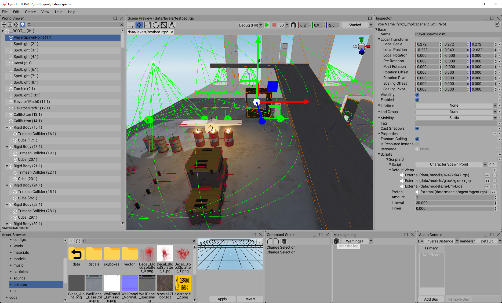

`fyrox-ui` now supports styling. This is a crucial feature needed for flexible user interface designs. Styling works quite simple:
a property that needs to support styling should be wrapped into `StyledProperty<T>` and that's pretty much it. Styled variable 
stores the value of `T` and also a name of the respective property it may be bound to. This mixed approach allows to override styled
properties with custom values and still have an ability apply styles later on.

To apply a style all that is needed is to send `WidgetMessage::Style` to it with an appropriate `StyleResource` instance. The widget
is then will try to find a property by the name specified in each `StyledProperty` and override its value with the one from the style.

It is also possible to apply a style to all widgets at once - just call `ui.set_style(..)` and it will automagically apply the style to
all widgets.

Every `UserInterface` instance stores its own style, which is then supplied to `BuildContext`, which in its turn is used at the building
stage by every widget. This way all new widgets created after the call to `set_style` will still have the right style.

For example, a `Decorator` widget that is used in `Button` widget could be created like this:

```rust
DecoratorBuilder::new(
    BorderBuilder::new(
        WidgetBuilder::new()
            .with_foreground(ctx.style.property(Style::BRUSH_DARKER))
            .with_child(content),
    )
    .with_pad_by_corner_radius(false)
    .with_corner_radius(ctx.style.property(Button::CORNER_RADIUS))
    .with_stroke_thickness(ctx.style.property(Button::BORDER_THICKNESS)),
)
.with_normal_brush(ctx.style.property(Style::BRUSH_LIGHT))
.with_hover_brush(ctx.style.property(Style::BRUSH_LIGHTER))
.with_pressed_brush(ctx.style.property(Style::BRUSH_LIGHTEST))
.build(ctx)
```

As you can see, most of its properties are actually style-bound properties. If the user then decides to call `ui.set_style` then all these
properties will fetch the right values from the given style.

## Fonts

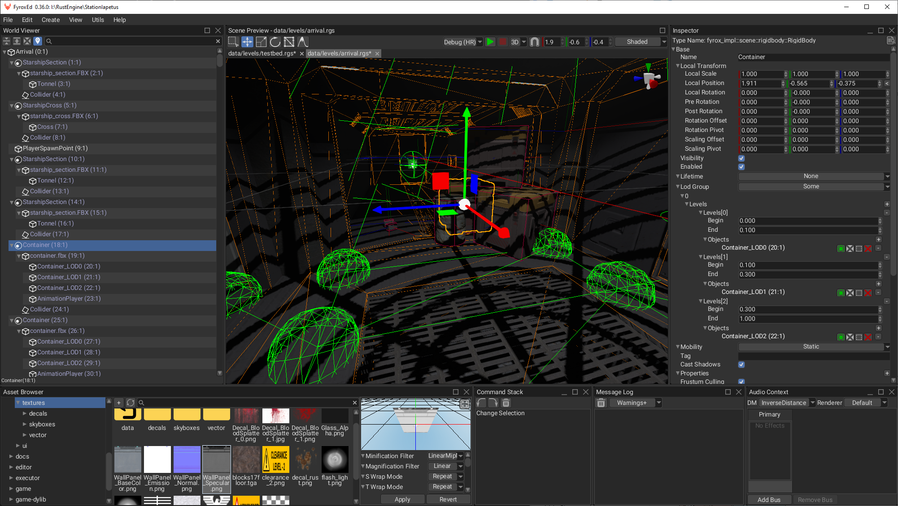

Fyrox 0.36 has finally fixed blurry fonts and it works good on Hi-DPI screens as well. Fonts are now also supports kerning, which makes fonts
to look as it meant to look like.

## Project Manager

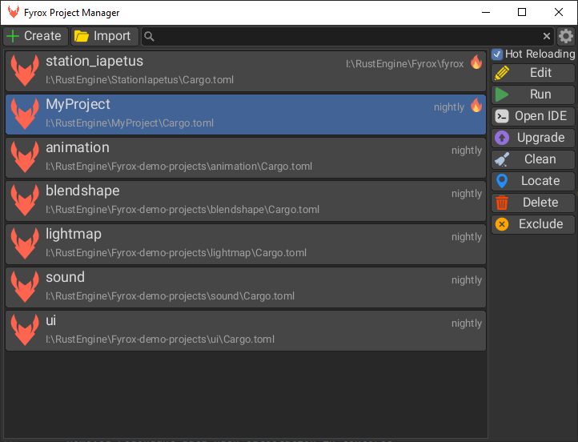

Project manager is a new part of the engine that allows you to manage multiple projects made with the at once. It allows you to create a new
project or import an existing one, run the project or edit it in the editor, upgrade the project to selected version of the engine and many 
more. Project manager also does all the heavy lifting for newcomers - it hides the complexity of using multiple console commands to run the
engine in different modes and basically allows you to run the engine in a few clicks.

The project manager is now the official, yet experimental, launcher for the engine. Its pre-built versions will be available
on the website using "Download" button. For now only Windows and Linux versions are available, other platforms (such as 
macOS) aren't yet available and manual installation should be used instead.

Keep in mind, that the project manager is fully optional and is not required for the engine to run, it is just a 
convenient tool for project management.

## Shape Editing for Colliders

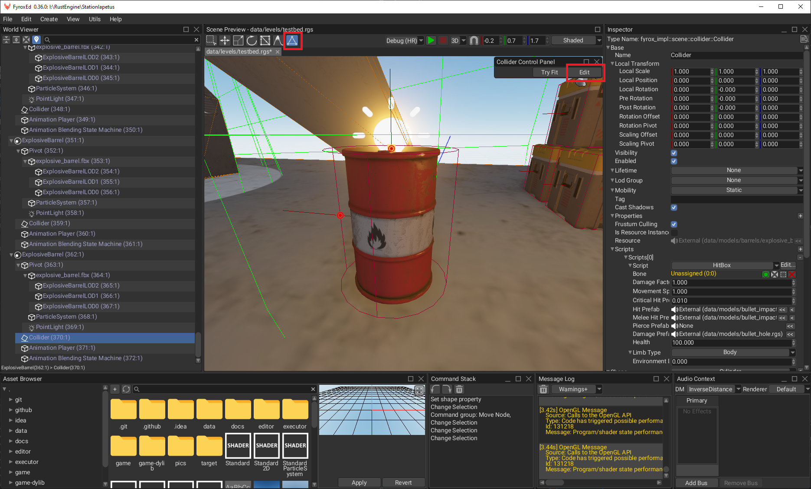

Is is now possible to edit collider shapes directly in the scene using the new collider shape editing plugin. This plugin can be activated using either the interaction mode with "triangle" button or by simply clicking the "edit"
button in the Collider Control Panel. This plugin supports pretty much every convex shape and also works in 2D mode.

## Graphics Server Abstraction

For a long time Fyrox was tied to OpenGL and it finally changed - all low level graphics code is now isolated in a graphics 
server abstraction. It has more or less modern interface, and could be used to use any other graphics API, such as Vulkan,
DirectX, etc. 

Changing the renderer in a project with ~250k lines of code is a huge task and this release of the engine still uses an 
OpenGL-based graphics server. It will be changed closer to release of Fyrox 1.0, which should happen this year.

## Renderer Refactoring

Renderer was significantly refactored to use an approach used in modern graphics APIs. 

- Ability to enable/disable scissor test from custom shaders
- Ability to specify depth func in custom shaders
- Added uniform buffers
- Added `UniformBufferCache` for easier handling of multiple UBOs
- Added bind groups + mandatory texture binding via render resources
- Ability to fetch graphics server capabilities
- Experimental `UniformMemoryAllocator`
Migration to uniform buffers
- Pass material properties using uniform buffers
    - Automatically generate uniform buffer description for material properties
    - Automatically define uniforms for samplers
    - No more need to manually define material properties in shaders, just use `properies.your_property_name`
- Use uniform memory allocator to speed up uniform data upload to gpu
    - Splits rendering of render bundles in two steps: uniform data collection + upload and the actual rendering
    - More efficient use of memory by utilizing all available space in uniform buffers (prevents having uniform
      buffers with just 200-300 bytes of memory, where the actual memory block on gpu is 4kb)
    - Significantly reduces amount of individual data transfers and gapi calls in general
    - Improves performance by 12-15%
- Use explicit binding for textures - prevents dozens of `glUniform1i` calls when drawing stuff, thus improving
  performance by 5-10% (more on WebAssembly, where each gl call is passed through JS)
- Refactored shader structure to include resource bindings
  - Makes shader structure more rigid and removes implicit built-in variables
  - Makes binding points of resources explicit
  - First pass, the editor is still broken an requires material editor refactoring as well

- Reworked materials
    - Material now stores only changed shader properties
    - Moved validation from set_property/bind to the renderer where it simply prints an error message to the log
      if something's wrong
    - Removed fallback value from texture resource binding, it makes no sense to duplicate this info since the correct
      one is stored in the shader anyway
    - Removed `default` property from texture definition in shaders
Do not reallocate gpu buffer if there's enough space for data already
Improved performance of render data collection
- Do not precompile built-in shaders on engine start
    - it is faster to compile them on-demand
    - on WebAssembly such compilation could take 10-15 seconds

    - Discard scaling from rotation matrix before passing it to bounding shape - fixes clipping issues of light sources

- Do not skip light scatter rendering even if there's no fragments lit - fixes flashing of light scattering

## Multi-selection in ListView Widget

- TODO

## Asset Browser

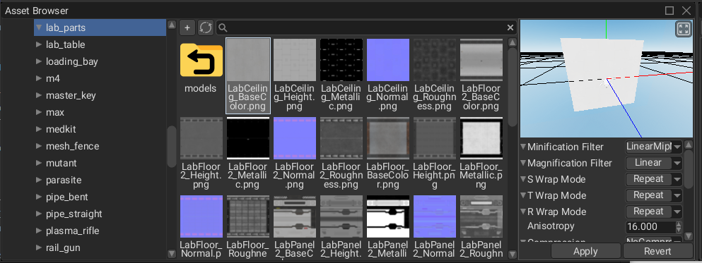

Asset browser has got some major improvements as well. It is now able to duplicate existing resources, it also has got
a "refresh" button to refresh its content. Asset browser also shows folders in the current directory:

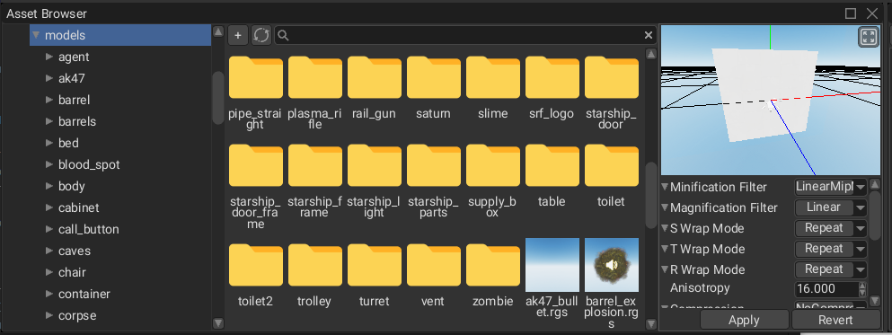

## NinePatch Improvements

`NinePatch` widget is used to split an image in nine sections, where each corner section will remain the same, while
the middle parts between each corner will be used to evenly fill the space. This widget is primarily used in games UI
to create resizable frames, buttons, windows, etc. 

This widget got some significant improvements in this release. First of all, there's no need to explicitly set UVs and
margins at the same time - all that is needed is to set margins and everything else will be calculated on the fly for
you. 

The next major improvement is the support for custom texture region, which is crucial for interfaces that use atlases
with multiple UI elements. Texture region allows specifying a rectangular region on the texture which is then will be
used for slicing. 

All this functionality is also backed by the new texture slice editor, which allows you to specify the region and margins and adjust them as you need:

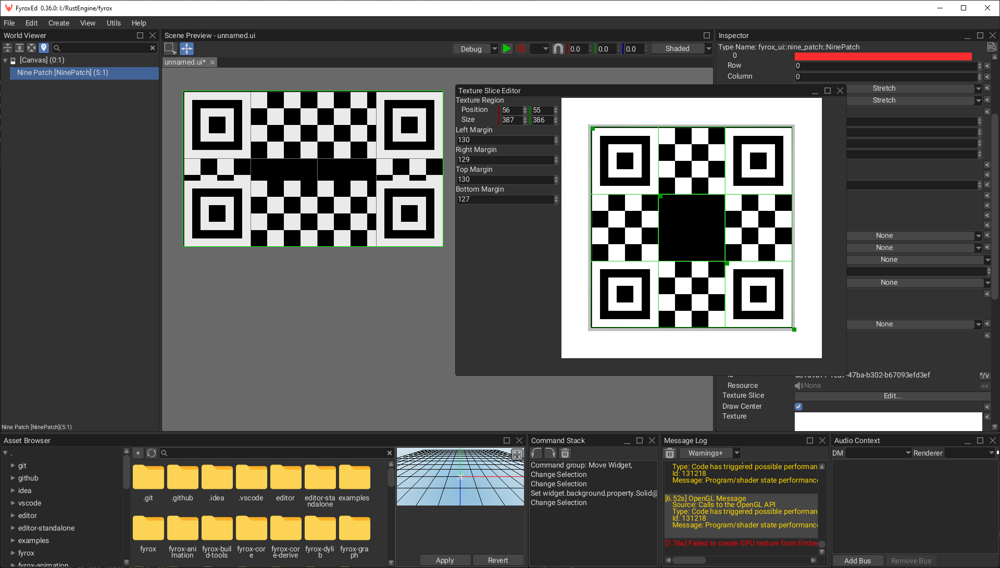

The next improvement is the support of configurable tiling modes. There are two modes supported: stretch and tiled.
The following image shows the difference between two. The upper one uses tiling and the bottom one just stretches the 
middle sections.

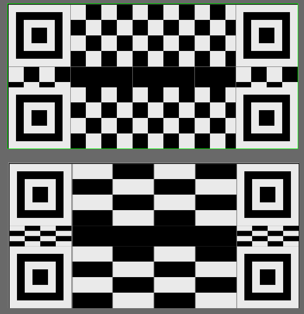

The last tiny, yet useful, improvement is the ability to hide center segment:

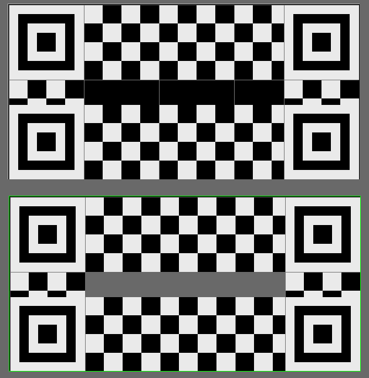

## Terrain Improvements

- TODO: Ability to cut holes in terrain. Improved terrain brush system

## Experimental Occlusion Culling

This release adds an experimental tile-based occlusion culling system. The main idea is to split the screen into 
multiple tiles, find which object belongs to which tile, render bounding boxes into a frame buffer with depth buffer 
from previous frame, find bit index for every pixel in tile for every bounding box and merge them all using additive 
blending. Downscale this "visibility buffer" and read it back on CPU and cache the visibility info for the next frame.
The full algorithm description [can be found in this article](https://fyrox.rs/blog/post/tile-based-occlusion-culling/).

There's also occlusion culling for light sources, which allows to skip light-specific render passes for lights that
are fully hidden behind objects.

Both of these features are disabled by default, because they still have some edge cases which aren't solved yet.
The main one is the latency problem, which could lead to object popping out of nowhere if the camera or an object
is moving too fast.

## Particle Systems


Particle systems are now has an ability to change coordinate system to which the generated particles will belong
to. There are two options - local (default) and world space. World space coordinate system is very useful for 
particles that should remain in place where they were created, but still let the coordinate system to be attached
to some other (potentially moving) objects.


The next improvement in particle systems is the configurable visibility distance. It allows to automatically exclude
distant particle systems from rendering to improve performance. This distance can be tweaked on per-system basis.

The last, but not least improvement for particle systems is lighting support. Lighting can be enabled/disabled in
the material properties in the material editor.

## Early Return Macros

Useful macros for early return statements - while `let-else` exists, it still takes more lines of code than it should.
These macros are much more compact and easier to read. The most commonly used macro is `some_or_return` and it is 
very simple:

```rust
#[macro_export]
macro_rules! some_or_return {
    ($expr:expr) => {{
        if let Some(v) = $expr {
            v
        } else {
            return;
        }
    }};
    ($expr:expr, $default:expr) => {{
        if let Some(v) = $expr {
            v
        } else {
            return $default;
        }
    }};
}
```

And here's an example of why it exists. These are two equivalent functions, but the first one is written using 
`let-else`, and the second one - with `some_or_return` macro:

```rust
fn no_macro(&mut self, message: &mut UiMessage, editor: &mut Editor) {
    let ui = editor.engine.user_interfaces.first_mut();
    let Some(wizard) = self.ragdoll_wizard.as_mut() else {
        return;
    };
    let Some(current_scene) = editor.scenes.current_scene_entry_mut() else {
        return;
    };
    let Some(game_scene) = current_scene.controller.downcast_mut::<GameScene>() else {
        return;
    };
    let graph = &mut editor.engine.scenes[game_scene.scene].graph;
    wizard.handle_ui_message(message, ui, graph, game_scene, &editor.message_sender);
}

fn with_macro(&mut self, message: &mut UiMessage, editor: &mut Editor) {
    let ui = editor.engine.user_interfaces.first_mut();
    let wizard = some_or_return!(self.ragdoll_wizard.as_mut());
    let current_scene = some_or_return!(editor.scenes.current_scene_entry_mut());
    let game_scene = some_or_return!(current_scene.controller.downcast_mut::<GameScene>());
    let graph = &mut editor.engine.scenes[game_scene.scene].graph;
    wizard.handle_ui_message(message, ui, graph, game_scene, &editor.message_sender);
}
```

As you can see the version with the macro is much more compact and less verbose. There are also `ok_or_return` macro
that works with `Result`s. The next group of macros is the ones that can alter control flow of loops: 
`some_or_continue`, `ok_or_continue`, `some_or_break`, `ok_or_break`. These have self-descriptive names.

## Curve Editor

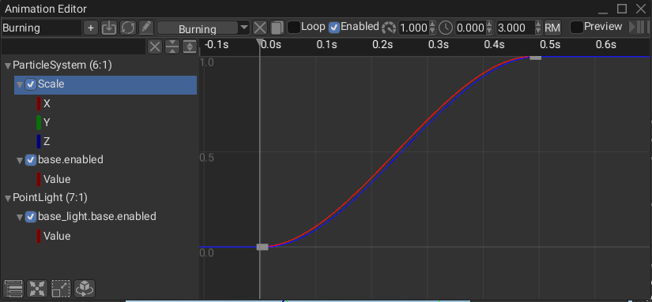

Curve editor has got some improvements as well. It is now possible to copy/paste selection. There's also a new ability 
to add keys on multiple curves at once. Hotkey for `Zoom to Fit` was also added (`F` key by default). 

## Editor ui statistics plugin

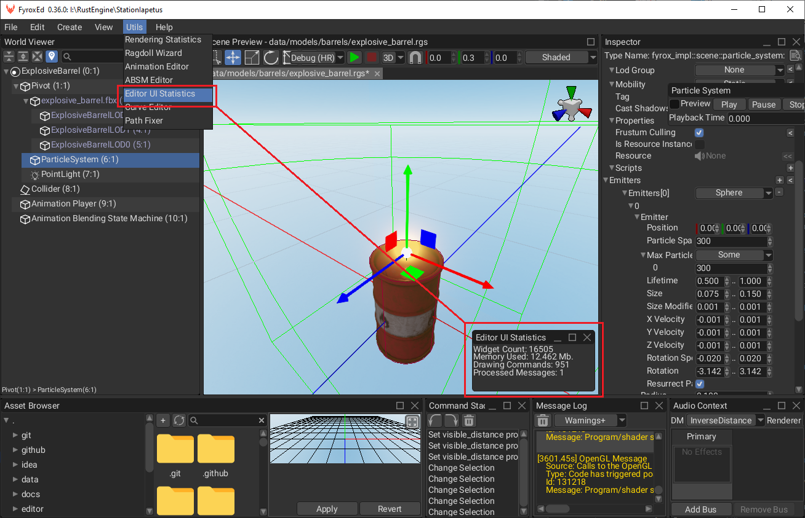

Editor UI statistics plugin allows you to debug the editor UI itself. It shows total number of allocated widgets,
used memory (rough estimate), the number of issued drawing commands and the number of processed UI messages on the
current frame. This information could be quite useful for when something goes wrong, for example widget counter
could be helpful to track non-deleted widgets, that might pile up while the editor is working and thus slowing
it down over time.

## Texture Settings

This release added more settings for textures which include:

- `Base Level` - the index of the lowest defined mipmap level. Keep in mind, that the texture data should 
provide the actual mip map level defined by the provided value, otherwise the rendering will be incorrect (probably 
just black on majority of implementations) and glitchy. 
- `Max Level` - the index of the highest defined mipmap level. Keep in mind, that the texture data should provide 
the actual mip map level defined by the provided value, otherwise the rendering will be incorrect (probably just black 
on majority of implementations) and glitchy.
- `Min LOD` - the minimum level-of-detail parameter. This floating-point value limits the selection of highest 
resolution mipmap (lowest mipmap level). The initial value is -1000.0. 
- `Max LOD` - the maximum level-of-detail parameter. This floating-point value limits the selection of the lowest 
resolution mipmap (highest mipmap level). The initial value is 1000.
- `LOD Bias` - a fixed bias value that is to be added to the level-of-detail parameter for the texture before 
texture sampling. The specified value is added to the shader-supplied bias value (if any) and subsequently clamped into 
the implementation-defined range `−bias_max..bias_max`, where `bias_max` is the value that can be fetched from the 
current graphics server. The initial value is 0.0.

## File Browser Improvements

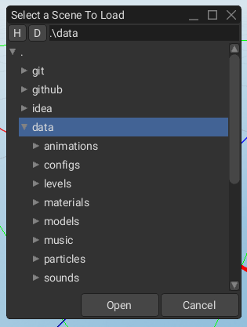

File browser was improved in this release as well. This released added home/desktop directories shortcut buttons for 
faster navigation. It is now possible to focus current path of the file browser. The default path of file browser 
was changed to `./`.

## Surface Resource

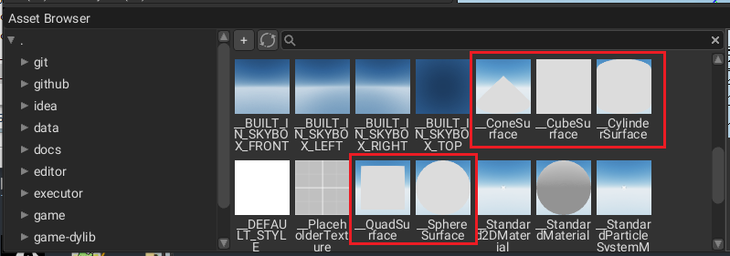

Every use of `Arc<Mutex<SurfaceData>>` was turned into `Resource<SurfaceData>` which essentially almost the same, except
it utilizes the standard asset management pipeline. This allowed the editor to operate with such resource instances 
as well.

## Node and Property Selector Improvements

- Node selector usability improvements
    - Focus search bar on open
    - Ability to confirm selection by enter key
    - Bring first selected item into view on open
    - Added tab navigation

  - Improved property selector
    - Focus search bar on opening
    - Tab navigation
    - Highlight selected properties on rebinding
    - Ability to confirm selection by hitting enter key  

## Constructor Provider

- TODO

## Performance improvements

- Editor perf improvements
- Detached perf of hierarchical properties propagation from graph size
    - Graph now updates hierarchical properties only for ones that actually changed
    - Significantly improves performance in static scenes
    Prevent the editor to load the same texture over and over again - saves memory
Fixed `MenuItem` performance issues

## `fyrox-texture` crate

- Detached texture-related code to separate crate - allows to attach it to `fyrox-ui` to use textures directly without
  using hacky `UntypedResource`
- Use TextureResource directly in ui code where possible - removes redundant juggling with untyped<->typed conversions

## Animation Improvements

Hijack control over animations from animations container in absm - now absm itself updates the animations it uses,
  and only those that are currently used either by a state or states of active transition
- Added `AnimationResource` which decoupled animation tracks data into a shared resource
    - Significantly reduces memory consumption when cloning animations, since it does not need to clone the tracks
      anymore.
    - Animation resource can be shared across multiple animations using the same tracks
    - Significantly speeds up instantiation of animation player scene node
    - Backward compatibility is preserved
- Exclude samples buffer from a list of animatable properties
Speed up access to animation curve data
- Fixed root motion jitter on looping animations - - loop boundaries were handled incorrectly, thus leading to error
  accumulation that led to annoying jitter after some iterations
  Fixed crash when deleting multiple animation tracks at once
- Removed redundant boxing when applying animation values - makes animation of arbitrary numeric properies significantly
  faster

## Tooltips

Tooltips now behaves the same as in many other desktop applications. Previously, tooltips appeared immediately after
the cursor was hover over a widget, now it has configurable interval which is 0.5 seconds by default. Tooltips are 
now invisible for hit test, which allows to click-through them and they do not get in the way as it was before.

## Logging

Logging was improved as well. There are three new macros: `info!`, `warn!`, `err!` which are just shortcuts for 
`Log::info(format!(..))` and other respective functions. Logging is now disabled by default and every game must 
enable it manually using `Log::set_file_name` or `Log::set_file` functions.

## Toggle button widget

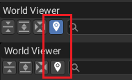

`ToggleButton` widget is somewhat similar to `CheckBox` widget in functionality, but it looks quite different. It is 
useful to create control elements that has just two states - on and off. For example, the above screenshot shows the
toggle button for selection tracking.

## Editor Settings Window

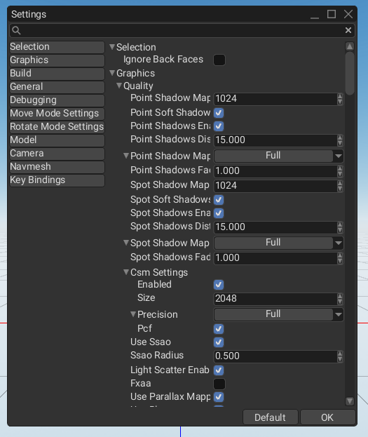

Editor settings window now has shortcuts for groups. It allows to quickly jump to a particular settings group, without
wasting time on scrolling. The new searching functionality increased usability as well.

## Full List of Changes

The list is split into four sections for ease of reading and finding particular information.

## Added

- Tile maps.
- UI styling support.
- Project manager to manage multiple Fyrox projects at once.
- Dropdown list docs.
- Implemented PartialEq for sprite sheet animation entities.
- Property editor for SurfaceDataResource.
- Surface data viewer for surface resource.
- `BaseSceneGraph::remove_nodes`.
- Ability to add/remove interaction modes dynamically.
- Shape editing for colliders.
- Shader for sprite-based gizmos (allows to draw sprite-based gizmos on top of everything else).
- `math::get_arbitrary_line_perpendicular`.
- Added ability to specify font-+its size for value indicator in `ScrollBar`.
- Ability to specify font size when building a button.
- Added ability to specify font and font size when creating window title.
- Added surface resource loader.
- Built-in surfaces.
- Added a configurable throttle frame interval for `Executor`.
- Added sanity check for brush operations to protect the editor from being overloaded by huge brushes.
- Messages for `Grid` widget - ability to change rows/columns/draw border/border thickness.
- `Material::texture` helper method.
- `Color::repeat_opaque` method.
- `DrawingContext::push_grid` method.
- `save + save_back` methods for resource.
- Added "refresh" button for asset browser.
- `ResourceDataRef::as_loaded_ref/mut` methods.
- Ability to open assets using double click.
- Multi-selection support for `ListVIew` widget.
- `impl PartialEq for Ray`.
- Add an ability to rotate the editor camera using scene gizmo.
- `impl From<&String> for ImmutableString`.
- Improved material api - `Material::set_property` is now much less verbose.
- Better support for fbx materials from 3DS max.
- Validation for 2d colliders.
- Added folders into asset browser.
- Ability to cut holes in terrain.
- Experimental occlusion culling for light sources.
- `read_pixels_of_type` to get typed pixels instead of raw bytes.
- Added `R32UI` texture format.
- `get_image` for gpu texture.
- Pixel buffer for async framebuffer reads.
- Include cache sizes in rendering statistics (helps in catching uncontrollable GPU memory usage growth).
- Ability to duplicate resources in asset browser.
- Added visible distance for particle systems.
    - Automatically excludes distant particle systems from rendering to improve performance.
    - Can be tweaked on a per-system basis.
- Ability to enable/disable scissor test from custom shaders.
- Ability to specify depth func in custom shaders.
- Added uniform buffers.
- Added `UniformBufferCache` for easier handling of multiple UBOs.
- Added bind groups + mandatory texture binding via render resources.
- Ability to fetch graphics server capabilities.
- Experimental `UniformMemoryAllocator`.
- Frustum culling for light sources.
- Support a saving/restoring the maximized flag of the editor's window.
- Ability to save all opened scenes at once + hotkeys.
- `AxisAlignedBoundingBox::project` method.
- `post_update` callback for `Plugin`.
- Editor plugins container - adds some useful methods for plugin search.
- More dockable windows.
- Ability to copy/paste selection in the curve editor widget.
- Added a configurable limit for message log to prevent excessive bloat.
- Configurable coordinate system for particle systems - allows selecting a coordinate system for generated particles—
  local or world.
- Lighting support for particle systems.
- `ModelResource::instantiate_and_attach` method.
- Ability to add keys on multiple curves at once.
- Hotkey for `zoom to fit` for curve editor widget.
- Useful macros for early return statements. While let-else exists, it still takes more lines of code than it should.
  these macros are much more compact and easier to read.
- `BaseControl::self_size` method.
- Editor ui statistics plugin. Allows tracking the total amount of widget used by the editor, which is useful to find if
  there are "dangling" widgets.
- `DockingManagerLayoutDescriptor::has_window` method.
- Print the total number of drawing commands of ui for the current frame.
- `remove_on_close` flag for `Window` widget.
- Ability to apply custom sorting for children widgets of a widget.
- Ability to sort menu items.
- Track processed ui messages in the editor - helps to find message queue overload.
- `has_component` helper methods.
- `StyleResource` resource type.
- Configurable routing strategy for ui messages.
- Helper methods for easier setting window icon.
- Add a `Zed` editor option into editor settings.
- Added configurable delay for tooltips.
    - Prevents tooltips from popping up instantly on mouse hover, instead there's a configurable (0.55 s by default)
      delay.
    - Removes annoying tooltip popping when moving mouse.
- Added more texture settings - base level, max level, min lod, max lod, lod bias.
- Added home/desktop directories shortcut buttons for file browser widget.
- Ability to focus the current path in the file browser widgets.
- Ability to specify graphics server constructor.
    - Essentially gives an ability to change graphics servers at creation/runtime stages.
    - By default still uses OpenGL graphics server.
- Added kerning support for fonts.
- `BuildContext::send_message` method.
- Added project manager CI.
- Backward compatibility for deserialization of `Untyped->Typed` resource.
- Ability to specify usage for element buffer.
- `info! + warn! + err!` log macros.
- Documentation improvements.
- `Downcast` trait to remove code bloat.
- Added tooltip for shader field in the material editor.
- Toggle button widget.
- Added tags for reflection.
- `WidgetBuilder::with_uniform_margin(..)`.
- Shortcuts for groups in editor settings: allows quickly jumping to a particular settings group.
- Searching functionality for editor settings.
- `impl TypeUuidProvider for Rect<T>`.
- Added property editors for `Option<Rect<T>>`.
- Nine patch widget improvements.
    - Added ability to specify a texture region for atlas support.
    - Remove explicit uv coordinates and calculate them on the fly.
    - Ability to disable drawing of the center region of the nine-patch widget.
    - Configurable tiling mode for nine-patch widget.
    - Easier editing of texture slice using new texture slice editor.
- Thumb widget for draggable things.
- Messages to change vertical and horizontal scrolling of ScrollViewer widget.

## Changed

- Included project license in every source file.
- Reset scene node transform to identity when making it root.
- Take z index into account when linking widgets.
- Split fyrox-template into lib + cli.
- Ability to specify project root dir for template-core.
- Optional app arguments. Prevents crash when trying to parse program arguments.
- Change key bindings to make more intuitive up/down motion.
- Replaced `SurfaceSharedData` into `Resource<SurfaceData>`
    - Surface shared data was essentially a resource of some sort anyway.
    - Allows saving meshes as resources externally.
    - Allows using standard resource pipeline for surface data.
- Simplified camera picking API in the editor.
- Improved terrain brush system.
- Print surface resource kind in the property editor.
- Fixed new object placement.
    - Children objects will stay at (0,0,0).
    - When creating via "Create" menu, a new object will be located in front of the camera.
    - When creating a parent object whose parent is root, it will also be located in front of the camera.
- Ability to specify name column width of inspector widget.
- Save camera projection mode in editor settings.
- Refactored editor camera controller - allows dragging the camera using mmb in 2d mode.
- Sort items of built-in resources.
- Remove native collider when its shape cannot be created.
- Hijack control over animations from animation container in ABSM - now ABSM itself updates the animations it uses,
  and only those that are currently used either by a state or states of active transition.
- Extract the rendering framework into a separate crate.
- Make fbx elements of mesh geometry optional.
    - Prints a warning message and continues reading.
    - This is needed to be able to load "malformed" fbx, that has no mesh geometry, such as animation-only fbx.
- Enable resource hot reloading by default in executor.
- Move `rotateVec2` to shared shader functions.
- Store initial data and file extension (if any) of built-in resources.
- Moved opengl initialization to the rendering framework.
- Use uniform buffer for bone matrices instead of texture matrix storage.
- Use uniform buffer to pass object instance data to shaders.
- Moved camera properties into its own uniform block.
- Switched to uniform buffers across the renderer.
- Pass material properties using uniform buffers.
    - Automatically generate uniform buffer description for material properties.
    - Automatically define uniforms for samplers.
    - No more need to manually define material properties in shaders, just use `properies.your_property_name`.
- Isolated opengl-specific code of gpu program into its own module.
- Use uniform memory allocator to speed up uniform data upload to gpu.
    - Splits rendering of render bundles in two steps: uniform data collection + upload and the actual rendering.
    - More efficient use of memory by using all available space in uniform buffers (prevents having uniform.
      buffers with just 200–300 bytes of memory, where the actual memory block on gpu is 4 kb).
    - It significantly reduces the number of individual data transfers and gapi calls in general.
    - Improves performance by 12–15%.
- Removed redundant buffer binding/unbinding - saves some time on api calls (especially in WebGL, where everything is
  proxied through JS).
- Pass sceneDepth texture to shaders explicitly.
- Use explicit binding for textures. Prevents dozens of `glUniform1i` calls when drawing stuff, thus improving
  performance by 5–10% (more on WebAssembly, where each gl call is passed through JS).
- Refactored shader structure to include resource bindings.
    - Makes shader structure more rigid and removes implicit built-in variables.
    - Makes binding points of resources explicit.
- Turned `Matrix2Editor` into generic-over-size `MatrixEditor`.
- Use immutable string in shader property name.
- Reworked materials.
    - Material now stores only changed shader properties.
    - Move validation from set_property/bind to the renderer where it simply prints an error message to the log
      if something's wrong.
    - Removed fallback value from texture resource binding, it makes no sense to duplicate this info since the correct
      one is stored in the shader anyway.
    - Removed `default` property from texture definition in shaders.
- Collect light info when constructing a render bundle. Removes redundant loop over scene graph nodes.
- Refactor hot reload to allow custom dynamic plugins besides dylib-based.
- Improved gpu texture api.
- Perform checked borrow in node message processing to prevent crashes. Crash could happen if a node is already deleted,
  but its message was still in the queue.
- Replaced component querying from nodes with `ComponentProvider` trait.
- Turned editor inspector into a plugin.
- Cloning physics when cloning Graph to persist Scene settings when saving Scene from the editor.
- TabControl improvements..
- Changed `traverse_iter` to return a pair of handle and ref - much more convenient when there's a need to handle a
  handle with a reference at the same time, no need to do re-borrow which is double work anyway.
- Added `AnimationResource` which decoupled animation tracks data into a shared resource.
    - Significantly reduces memory consumption when cloning animations, since it does not need to clone the tracks
      anymore.
    - Animation resource can be shared across multiple animations using the same tracks.
    - Significantly speeds up the instantiation of animation player scene node.
    - Backward compatibility is preserved.
- Focus search bar's text box when focusing toolbar itself - toolbar focus makes no sense anyway, because it does not
  interact with keyboard, but text box does.
- Node selector usability improvements.
    - Focus search bar on open.
    - Ability to confirm selection by enter key.
    - Bring the first selected item into view on open.
    - Added tab navigation.
- Lazy z-index sorting instead of on-demand.
- Exclude samples buffer from a list of animatable properties.
- Improved property selector.
    - Focus search bar on opening.
    - Tab navigation.
    - Highlight selected properties on rebinding.
    - Ability to confirm selection by hitting the enter key.
- Detached material-related parts of the editor into its own plugin - material editor is now non-existent by default and
  created only when needed, which saves memory (both ram and vram) and cpu/gpu time.
- Detached ragdoll wizard into a separate plugin.
- Move the settings window into a separate plugin.
- Move the animation editor into its own plugin.
- Improved editor plugins api.
- Create animation editor on editor start if animation editor was docked before.
- Move the absm editor to a separate plugin.
- Create save file selector for prefabs on demand.
- Move the curve editor window into its own plugin.
- Move the path fixer into a plugin.
- Use builtin surfaces for meshes created in the editor.
- Migrated to latest `tinyaudio`.
- Removed hardcoded ui widgets constructors. It replaced with user-defined constructors via `ConstructorProvider` trait.
- Sort menu items in alphabetical order in creation menus.
- Replaced hardcoded ui style variables with configurable styles.
- Make tooltips invisible for hit test.
- Move the log panel to `fyrox-ui`.
- Keep the editor running until the active popup is fully shown.
- Change the default path of file browser to `./`.
- Disable log file by default. The log file could be undesirable in some cases, and now it is off by default and can be
  enabled by `Log::set_file_name/set_file` in `fn main`.
- Explicit api to change the log file.
- Replaced proprietary Arial font with Roboto in the editor.
- Do not precompile built-in shaders on engine start.
    - It is faster to compile them on-demand.
    - On WebAssembly such compilation could take 10–15 seconds.
- Detached texture-related code to separate crate. It allows attaching it to `fyrox-ui` to use textures directly without
  using hacky `UntypedResource`.
- Use TextureResource directly in ui code where possible - removes redundant juggling with untyped↔typed conversions.
- Force `Image` widget to use texture size on measurement stage - removes "surprising effect" with collapsed image, if
  width/height is not set explicitly.
- Audio initialization errors non-fatal now. It allows running the engine in environments without proper audio output
  support.
- Print editor version in the window title.
- Print editor version in the log on start.
- Replace the hardcoded version of the engine with the one from Cargo.toml. This is a semi-reliable solution, but much
  better than having the hardcoded version.
- Close projection (2d/3d) selector on selection.
- Use toggle button for `track selection` in the world viewer.
- Put the search bar of the world viewer on the same row with other buttons.
- Moved `load_image` to `fyrox-ui` utils.

## Fixed

- Fixed blurry fonts.
- Significantly improved editor performance.
- Improved joint stability after migration to the latest Rapier physics.
- Use z index from the respective message.
- Fixed crash when trying to change window title using the respective message.
- Fixed procedural meshes serialization.
- Fixed inspector syncing when replacing the selected object with another type.
- Fixing Rect tests in fyrox-math.
- `transmute_vec_as_bytes` soundness fix.
- Fixed crash when trying to drag'n'drop non-texture in texture field.
- Refresh asset browser after asset deletion.
- Better validation for colliders.
- Support for chained texture nodes in fbx - fixes normal map import on FBX files made in latest 3ds max/Maya/etc.
- Watch for changes in the current directory and refresh asset browser content.
- Fixed potential crash when cloning ui nodes.
- Fixed tool installation check in project exporter.
    - Do not try to install already installed tools.
    - Prevents accessing the network when there's no actual need.
- Fixed redundant texture binding if it is already bound to pipeline.
- Discard scaling from rotation matrix before passing it to bounding shape - fixes clipping issues of light sources.
- Do not skip light scatter rendering even if there's no fragments lit. It fixes flashing of light scattering.
- Fixed shadow map lod selection condition.
- Speed up access to animation curve data.
- Use `ImmutableString` in `ValueBinding` to make it smaller results in faster copying (32 bytes vs. 16 bytes).
- Prevent render targets from registering multiple times in texture cache.
- Improved performance of render data collection.
- Drop inherited `RUSTFLAGS` for project exporter child processes.
- Fixed crash when rendering large bundles.
- Do not reallocate gpu buffer if there's enough space for data already.
- Ignore buffer write commands when the data is empty.
- Set glsl es precision to `highp`.
- Fixed an invalid editor window size on second startup at the hidpi display.
- Ensure vector images have a set size.
- Fix crash on macOS in notify crate when the path is set first time.
- Reduced code bloat by isolating fallback textures into their own struct.
- Fix wasm tests fails due to using of the deprecated PanicInfo.
- Discard scaling part when calculating light source bounding box.
- Excluded some non-animatable properties from property selector.
- Detached perf of hierarchical properties propagation from graph size.
    - Graph now updates hierarchical properties only for ones that actually changed.
    - Significantly improves performance in static scenes.
- Prevent redundant global transform update for 2d rigid bodies.
- Fixed "teleportation" bug (when a scene node was located at world's origin for one frame and then teleports back
  where it should be).
- Prevent potential nan in `vector_to_quat`.
- Fixed convergence in reverb sound effect.
- Fixed root motion jitter on looping animations - loop boundaries were handled incorrectly, thus leading to error
  accumulation that led to annoying jitter after some iterations.
- Fixed visible borders around point lights.
- Reduced code bloat in the engine internals.
- Fixed transform syncing of colliders.
- Fixed `Inspector` widget syncing issues.
- Fixed crash when deleting multiple animation tracks at once.
- Fix for UI layout, including Grid and Text.
- Fixed crash when trying to fetch intersections from a deleted collider.
- Fixed crash when trying to collect animation events without a root state.
- Fixed crash when using `accurate_world_bounding_box` on some meshes - it would crash if a mesh has no position/bone
  indices/bone weights attributes in its vertex buffer.
- Fixed name of ragdoll joint generated by ragdoll wizard.
- Improved overall editor performance and ui nodes linking in particular.
- Prevent redundant syncing of the editor settings window - saves ~10% of time.
- Prevent the editor from loading the same texture over and over again.
- Fixed keyboard navigation for tree root - fixes annoying issue which causes keyboard focus to stick at tree root.
- Fixed camera preview panel size.
- Fixed deletion of some widgets.
- Fixed arrow visibility of menu item when dynamically changing its items.
- Fixed `MenuItem` performance issues.
- Fixed syncing of material editor shader field.
- Added `fyrox-build-tools` crate which essentially contains build tools from the editor.
- Fixed incorrect texture bindings invalidation - caused weird bug with incorrect textures applied to some objects (very
  noticeable in the ui after resizing the window).
- Use mip mapping for icons in the editor to smooth icons in the editor.
- Fixed background color "leaking" during `Border` widget rendering.
- Fixed syncing bug of R coordinates for volume textures.
- Fixed transform order in visual transform calculation.
- Fixed incorrect memory alignment when deserializing `BinaryBlob`.
- Fixed crash when using nine-patch widget without a texture.
- Fixed crash when dropping non-texture resource on texture field.

## Removed

- Removed redundant data hash calculation in textures.
- Removed redundant field from render data bundle - `is_skinned` flag makes no sense, because it could be derived
  from bone matrix count anyway and it is always defined on the per-instance basis, not per-bundle.
- Remove redundant decal layer index from mesh/terrain/render the data bundle. These are residuals from before
  custom material era, it makes no sense now since decal layer index is defined in materials and these fields simply had
  no effect.
- Removed depth offset.
    - It could be done with shaders.
    - Removed because it adds unnecessary projection matrix juggling for each rendered instance.
- Removed implicit blend shapes storage passing to material shaders - it is now controlled directly from `Mesh` node,
  and it creates temp material to pass blend shape storage explicitly.
- Removed `PersistentIdentifier` and `MatrixStorageCache`.
- Removed `cast_shadows` property from `BaseLight` - this property at some point started to be redundant, because `Base`
  already has such property and the one in `BaseLight` must be deleted to prevent confusion.
- Remove an incorrect error message in the animation editor.
- Removed `Node::query_component_ref/mut`.
    - It duplicates existing functionality.
    - Replaced with `SceneGraphNode::component_ref/mut`.
- Removed redundant boxing when applying animation values - makes animation of arbitrary numeric properies significantly
  faster.

## What's Next?

The next major goal for the project is to release Fyrox 1.0, which is planned for this year. This will be a massive push in stability,
documentation and book quality, existing features will be polished as well. The engine will be able to help in development from start to finish, 
essentially providing an IDE for game development in Rust.

## Support

If you want to support the development of the project, click [this link](https://fyrox.rs/sponsor.html). Also, you can help by 
fixing one of the ["good first issues" ](https://github.com/FyroxEngine/Fyrox/issues?q=is%3Aopen+is%3Aissue+label%3A%22good+first+issue%22),
adding a desired feature to the engine, or making a contribution to the [book](https://github.com/fyrox-book)